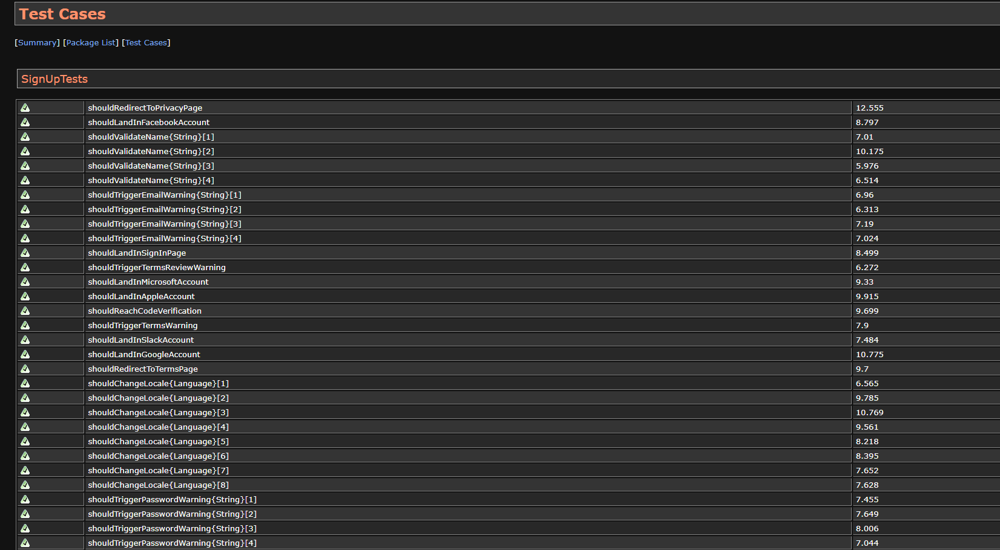
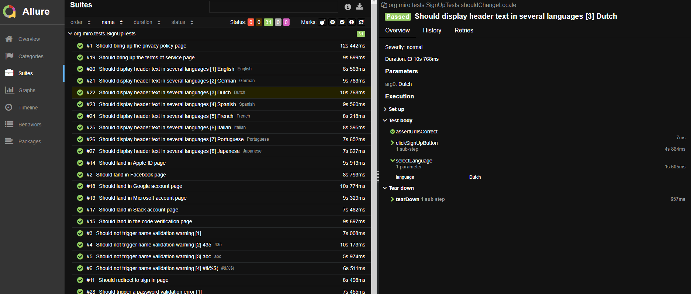

<br />
<p align="center">
  <a href="https://gitlab.com/MartinSorani/miro.testproject">
    
  </a>

  <h3 align="center">Miro Test Project</h3>

  <p align="center">
    Short test suite for Miro sign up flow
  </p>


## Table of Contents

* [Assignment requirements](#requirements-for-this-assignment)
  * [Built With](#built-with)
* [Prerequisites](#prerequisites)
  * [Running tests](#running-tests)
* [Configuration](#configuration)
* [Output](#output)
* [Reporting](#reporting)
* [Test suite documentation](#test-suite-documentation)
* [Contact](#contact)


## Requirements for this assignment

● Feel free to choose a coding language among Javascript/Typescript/Java. We
would suggest to pick Typescript since our team is using TS as main E2E UI test
language
● You could choose any test framework such as selenium, playwright, cypress or
testcafe etc.
● Please avoid using some BDD Framework such as Cucumber.
● Please add a Readme within the project
● We can consider a successful registration when the "Check your email" screen is
visible.
● The way to manage test structure is also as important as designing the test
cases from all possible perspectives.
● We suggest the code of the implemented assignment should not be shared
publicly. Please host your code within Gitlab and share with qa.review@miro.com.


### Built With

* [Apache Maven](https://maven.apache.org)
* [Junit 5](https://junit.org/junit5/)
* [Java](https://www.java.com/en/)
* [Selenium](https://www.selenium.dev/)

### Prerequisites

This project requires Java 8+ and Apache Maven to run.
Download and install java for your OS from [https://www.java.com/en/](https://www.java.com/en/).
Verify your Java installation by running the command

`java -version`
~~~
java version "1.8.0_181"
Java(TM) SE Runtime Environment (build 1.8.0_181-b13)
Java HotSpot(TM) 64-Bit Server VM (build 25.181-b13, mixed mode)
~~~

Download Maven from [https://maven.apache.org](https://maven.apache.org) and follow the instructions for installation.
Verify your Maven installation by running

`mvn -v`
~~~
Apache Maven 3.8.5 (3599d3414f046de2324203b78ddcf9b5e4388aa0)
Maven home: E:\Program Files\apache-maven-3.8.5
Java version: 1.8.0_181, vendor: Oracle Corporation, runtime: E:\Program Files\Java\jdk1.8.0_181\jre
Default locale: en_US, platform encoding: Cp1252
OS name: "windows 10", version: "10.0", arch: "amd64", family: "windows"
~~~

## Running tests

To get a local copy up and running follow these steps:

1. Clone the repo
```sh
git clone git@gitlab.com:MartinSorani/miro.testproject.git
```
2. Run the tests
```sh
mvn clean test
```


## Configuration

This project uses Selenium Webdriver to emulate and automate interaction with different web browsers.
The supported browsers for this project are:
- **Firefox**
- **Edge**
- **Chrome**

In order to specify the browser to emulate we can:

a. Add the parameter `Dbrowser` to the Maven command:

```sh
mvn clean test -Dbrowser=Firefox
```
**or**

b. Configure the desired option in the file [`src/main/resources/test.config.properties`](src/main/resources/test.config.properties)

~~~
browser = Edge
~~~

In the same manner, we can specify if our browser instance is to run headless:

a. Add the parameter `Dheadless` to the Maven command:

```sh
mvn clean test -Dheadless=true
```
**or**

b. Configure the desired option in the file [`src/main/resources/test.config.properties`](src/main/resources/test.config.properties)

~~~
headless = true
~~~

## Output

After all tests have run, an output log file will be generated with the name `MiroTests.log`. You can use this file to debug each step of the test cases.

If a test results in a failure, a screenshot of the browser's state will be saved in the `/screenshots/` folder with the time of the failure as the file name.

## Reporting

This framework generates surefire reports automatically. There is no need to set up any external tool in order to access the report.

To generate a surefire report, run the tests using the command

```sh
mvn site
```
Once the test run is completed, you'll be able to access an .html version of the report in the file 

`/target/site/surefire-report.html`



However, this project also generates a nicer report version using the [Allure](https://github.com/allure-framework/allure2) framework.

To access this version, you'll need to [download](https://github.com/allure-framework/allure2/releases) the latest Allure version and add the bin path `{installation.folder\Allure\bin}` to your system environment path.

After that, you can generate the Allure report by running the command

```sh
allure serve allure-results
```

The generated report should look like this:



## Test suite documentation

Access this test suite documentation in [Qase](https://app.qase.io/project/MTP?view=1&suite=4) or download the html version at [TestCases.html](./documents/TestCases.html)

## Contact

Martin Sorani - [martin.sorani@gmail.com](mailto:martin.sorani@gmail.com)


